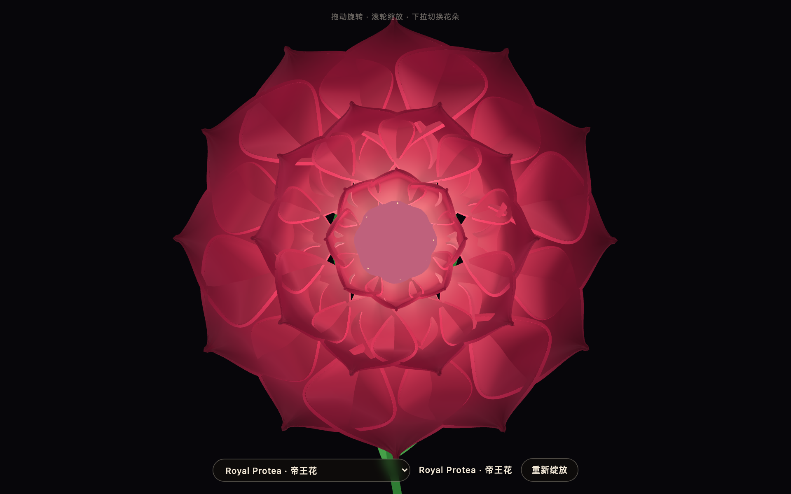
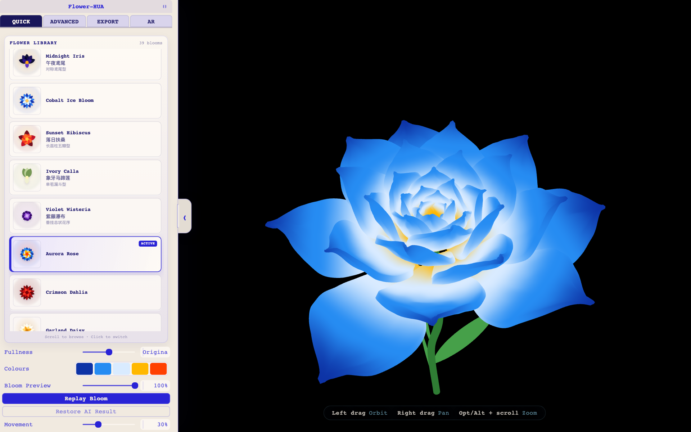
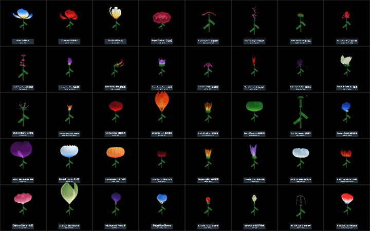
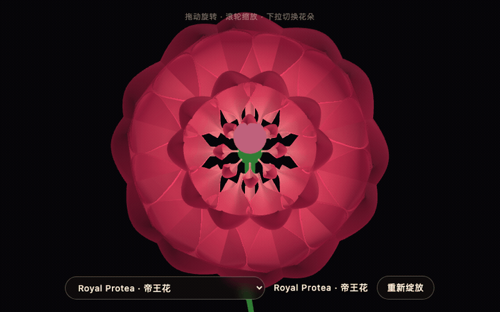
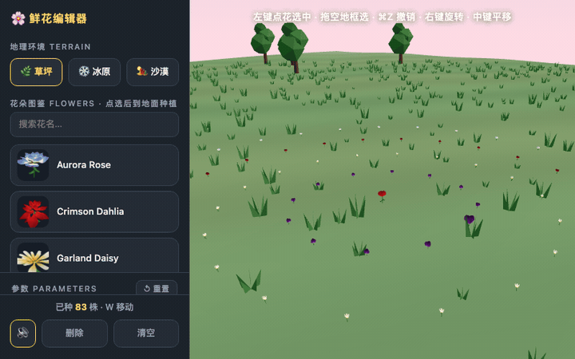
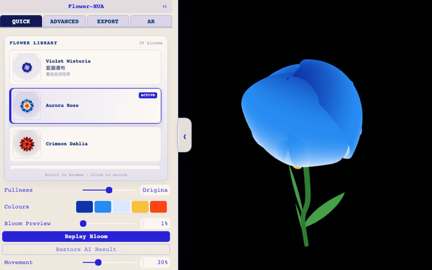
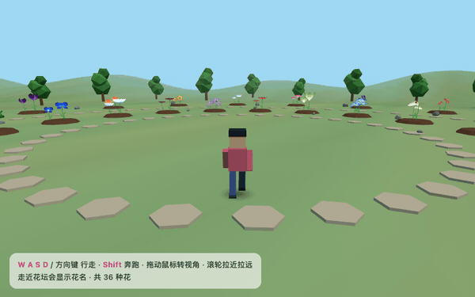
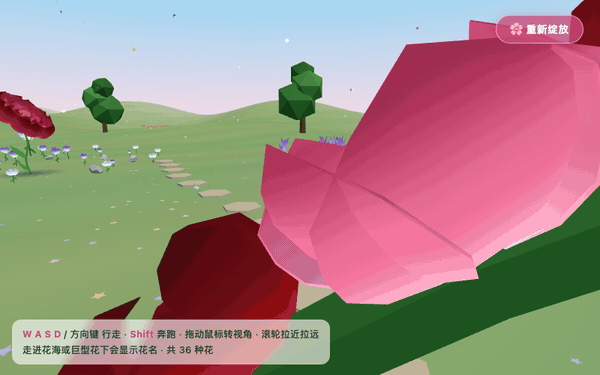

<p align="center">
  <a href="README.md"></a>
  &nbsp;
  <a href="README.en.md"></a>
</p>

# Flower-HUA · flower-engine

> A procedural bloom engine that turns a reference image into an editable,
> animatable, exportable 3D flower — plus the Agent Skill that distils its
> parameter surface into tables.

## 📦 What's in here

An **Agent Skill** repository, shipped with a set of click-to-open demos:

| | |
|---|---|
| 🧠 **The skill itself** | [`SKILL.md`](SKILL.md) + [`references/`](references/) — five reference documents, ~2000 lines. **This is the point of the repo.** |
| 🌸 **Live demos** | [`docs/`](docs/) — seven single-file HTML pages showing what the engine can build |

---

## 🧠 The flower-engine Skill

The substance of this repository is an **Agent Skill** — the engine's knowledge
lifted out of 4887 lines of `flowerScene.ts` plus 761 lines of
`flowerAnatomy.ts` and written down as tables you can look things up in.

| File | Contents |
|---|---|
| [`SKILL.md`](SKILL.md) | Trigger description, code map, the six-step authoring loop, hard limits |
| [`references/params.md`](references/params.md) | **All 43 engine parameters** — default, range, visual effect, and the rebuild / bake / uniform **cost class** that decides which are safe to drag live and which rebuild the whole mesh |
| [`references/anatomy.md`](references/anatomy.md) | **26 structure families × 25 core organ kinds** — whorl counts, variation curves, core defaults, and the double clamp on `core.count` |
| [`references/translate.md`](references/translate.md) | Reference image → `FlowerConfig`, step by step, with the authoring conventions **measured** across the 36 shipped flowers and one worked example |
| [`references/build.md`](references/build.md) | The three data stores, Studio lifecycle, export pipeline, single-HTML bundler, three Playwright verifiers |
| [`references/pitfalls.md`](references/pitfalls.md) | ~20 failure modes already encoded as constraints in the engine source |

**Every figure was verified against the source rather than recalled**: all 43
parameter defaults, all 26 family rows (whorls, core kind, core size / height /
count, the seven variation values each), and every `count` ceiling — each one
checked by script against `flowerScene.ts` and `flowerAnatomy.ts`.

### Install

Claude Code:

```bash
git clone https://github.com/VR-Jobs/Flower-skill.git
ln -s "$(pwd)/Flower-skill" ~/.claude/skills/flower-engine
```

Codex and other Agent Skills hosts read `~/.agents/skills` instead — link it there.

### It documents a codebase it does not contain

Paths in these files (`Studio/components/flower/flowerScene.ts`,
`data/flowers.json`, `scripts/upsert_flower.py`, `tools/single-html/`) are
relative to the **Flower-HUA project root**, not to this repository. The Skill
is a reading and authoring guide for that codebase — check it out alongside, or
read these files on their own as a design record of how the engine works.

---

## 🌸 Live demos (click and go, nothing to install)

| | Screenshot | What it is | Size |
|---|---|---|---|
| **[▶ Flower Gallery](https://vr-jobs.github.io/Flower-skill/)** |  | All 36 flowers, switchable. Drag to orbit, scroll to zoom, click to replay the bloom. **Start here** | 2.3 MB |
| **[▶ Full Studio](https://vr-jobs.github.io/Flower-skill/studio.html)** |  | 39 flowers plus the Quick / Advanced / Export / AR panes, all 43 parameters live, MP4 and PNG-sequence export | ⚠️ 43 MB, first load takes a while |
| **[▶ Display Case](https://vr-jobs.github.io/Flower-skill/demos/display-case.html)** |  | 40 flowers, one per cell. Drag to rotate every flower to any angle, arrow keys snap 90° between front / side / top, Space blooms or closes them all, `Esc` fills the screen | 2.4 MB |
| **[▶ Flower Editor](https://vr-jobs.github.io/Flower-skill/demos/flower-editor-lite.html)** |  | Map-editor-style planting: 3 terrains · 39 flowers · batch planting · brush strokes · 14 art styles · undo/redo · save & share · walk mode | 2.8 MB |
| **[▶ Flower Editor, full](https://vr-jobs.github.io/Flower-skill/demos/flower-editor.html)** |  | The same editor plus **AR gesture planting** — the camera tracks your hand, point with your index finger and pinch to plant. Chrome only | ⚠️ 29 MB |
| **[▶ Flower World](https://vr-jobs.github.io/Flower-skill/demos/flower-world.html)** |  | A thousand-flower sea: mandala beds, flower arches, mixed borders, giant bouquet mounds — walk in under the blooms | 2.5 MB |
| **[▶ Garden Walk](https://vr-jobs.github.io/Flower-skill/demos/garden-walk.html)** |  | A low-poly character strolling a garden; walk up to a bed to read the flower's name. `WASD` to walk, `Shift` to run | 2.4 MB |

> 🗂 **[Landing page for all of them →](https://vr-jobs.github.io/Flower-skill/demos/)**

The gallery honours deep links, so you can point straight at one flower:
[`#velvet-dahlia`](https://vr-jobs.github.io/Flower-skill/#velvet-dahlia) ·
[`#moonlit-lotus`](https://vr-jobs.github.io/Flower-skill/#moonlit-lotus) ·
[`#sun-gold-sunflower`](https://vr-jobs.github.io/Flower-skill/#sun-gold-sunflower)

> **Why can't you just click the `.html` files in this repo?**
> GitHub's file view renders HTML as source, and `raw.githubusercontent.com`
> serves it as `text/plain` — neither displays a page. The links above go
> through GitHub Pages, which is the only route that actually opens them.

Here is what the full Studio looks like — flower library on the left, the
Quick / Advanced / Export / AR panes, and the live render on the right:


All 36 flowers at a glance:


---

## 🌼 Flower catalogue

Every one of the 36 is rendered live by the engine. The images below are
headless browser captures (620×620, software WebGL) — not painted artwork.

<table>
<tr>
<td align="center" width="25%"></td>
<td align="center" width="25%"></td>
<td align="center" width="25%"></td>
<td align="center" width="25%"></td>
</tr>
<tr>
<td align="center"><b>Royal Protea</b><br><sub><code>protea-crown</code></sub></td>
<td align="center"><b>Ruby Bleeding Heart</b><br><sub><code>bleeding-heart-raceme</code></sub></td>
<td align="center"><b>Rose Snapdragon</b><br><sub><code>snapdragon-spike</code></sub></td>
<td align="center"><b>Golden Pincushion</b><br><sub><code>pincushion-rays</code></sub></td>
</tr>
<tr>
<td align="center" width="25%"></td>
<td align="center" width="25%"></td>
<td align="center" width="25%"></td>
<td align="center" width="25%"></td>
</tr>
<tr>
<td align="center"><b>Crimson Torch Ginger</b><br><sub><code>torch-ginger</code></sub></td>
<td align="center"><b>Coral Foxglove</b><br><sub><code>foxglove-spike</code></sub></td>
<td align="center"><b>Amethyst Columbine</b><br><sub><code>columbine-spurs</code></sub></td>
<td align="center"><b>Bird of Paradise</b><br><sub><code>bird-fan</code></sub></td>
</tr>
<tr>
<td align="center" width="25%"></td>
<td align="center" width="25%"></td>
<td align="center" width="25%"></td>
<td align="center" width="25%"></td>
</tr>
<tr>
<td align="center"><b>Passionflower Corona</b><br><sub><code>passion-corona</code></sub></td>
<td align="center"><b>Fuchsia Lantern</b><br><sub><code>pendant-fuchsia</code></sub></td>
<td align="center"><b>Scarlet Spider Lily</b><br><sub><code>recurved-spider</code></sub></td>
<td align="center"><b>Black Bat Flower</b><br><sub><code>bat-wing</code></sub></td>
</tr>
<tr>
<td align="center" width="25%"></td>
<td align="center" width="25%"></td>
<td align="center" width="25%"></td>
<td align="center" width="25%"></td>
</tr>
<tr>
<td align="center"><b>Moonlit Cereus</b><br><sub><code>nocturnal-star</code></sub></td>
<td align="center"><b>Violet Allium</b><br><sub><code>spherical-umbel</code></sub></td>
<td align="center"><b>Dandelion Metamorphosis</b><br><sub><code>metamorphic-dandelion</code></sub></td>
<td align="center"><b>Scarlet Rose</b><br><sub><code>spiral-rosette</code></sub></td>
</tr>
<tr>
<td align="center" width="25%"></td>
<td align="center" width="25%"></td>
<td align="center" width="25%"></td>
<td align="center" width="25%"></td>
</tr>
<tr>
<td align="center"><b>Tangerine Lily</b><br><sub><code>six-whorl</code></sub></td>
<td align="center"><b>Sun Gold Sunflower</b><br><sub><code>radial-disc</code></sub></td>
<td align="center"><b>Emerald Carnation</b><br><sub><code>ruffled-mass</code></sub></td>
<td align="center"><b>Cyan Hydrangea</b><br><sub><code>cluster-florets</code></sub></td>
</tr>
<tr>
<td align="center" width="25%"></td>
<td align="center" width="25%"></td>
<td align="center" width="25%"></td>
<td align="center" width="25%"></td>
</tr>
<tr>
<td align="center"><b>Sapphire Orchid</b><br><sub><code>bilateral-orchid</code></sub></td>
<td align="center"><b>Violet Tulip</b><br><sub><code>six-whorl</code></sub></td>
<td align="center"><b>Moonlit Lotus</b><br><sub><code>broad-whorls</code></sub></td>
<td align="center"><b>Sunset Peony</b><br><sub><code>ruffled-mass</code></sub></td>
</tr>
<tr>
<td align="center" width="25%"></td>
<td align="center" width="25%"></td>
<td align="center" width="25%"></td>
<td align="center" width="25%"></td>
</tr>
<tr>
<td align="center"><b>Velvet Dahlia</b><br><sub><code>quilled-sphere</code></sub></td>
<td align="center"><b>Golden Daisy</b><br><sub><code>radial-disc</code></sub></td>
<td align="center"><b>Lavender Aster</b><br><sub><code>radial-disc</code></sub></td>
<td align="center"><b>Arctic Camellia</b><br><sub><code>broad-whorls</code></sub></td>
</tr>
<tr>
<td align="center" width="25%"></td>
<td align="center" width="25%"></td>
<td align="center" width="25%"></td>
<td align="center" width="25%"></td>
</tr>
<tr>
<td align="center"><b>Ember Chrysanthemum</b><br><sub><code>quilled-sphere</code></sub></td>
<td align="center"><b>Sakura Cloud</b><br><sub><code>broad-whorls</code></sub></td>
<td align="center"><b>Jade Magnolia</b><br><sub><code>six-whorl</code></sub></td>
<td align="center"><b>Midnight Iris</b><br><sub><code>bilateral-orchid</code></sub></td>
</tr>
<tr>
<td align="center" width="25%"></td>
<td align="center" width="25%"></td>
<td align="center" width="25%"></td>
<td align="center" width="25%"></td>
</tr>
<tr>
<td align="center"><b>Cobalt Ice Bloom</b><br><sub><code>legacy</code></sub></td>
<td align="center"><b>Sunset Hibiscus</b><br><sub><code>hibiscus-column</code></sub></td>
<td align="center"><b>Ivory Calla</b><br><sub><code>calla-spathe</code></sub></td>
<td align="center"><b>Violet Wisteria</b><br><sub><code>wisteria-raceme</code></sub></td>
</tr>
</table>

### Grouped by structure

The engine classifies by **visible structure**, never by botanical name. These
36 flowers cover **all 26** structure families, with none left out. The core
(`core.kind`) is a separate geometry system — discs, stamen crowns, lips,
spadices, seed globes, whiskers and 19 more — not petals pretending to be one.

| Structure family `family` | Flower | Petals | Core organ `core.kind` |
|---|---|---|---|
| `broad-whorls` | Moonlit Lotus | 24 | `seedpod` |
|  | Arctic Camellia | 38 | `none` |
|  | Sakura Cloud | 18 | `stamen-crown` |
| `radial-disc` | Sun Gold Sunflower | 34 | `disc` |
|  | Golden Daisy | 34 | `disc` |
|  | Lavender Aster | 78 | `disc` |
| `six-whorl` | Tangerine Lily | 6 | `stamen-crown` |
|  | Violet Tulip | 6 | `none` |
|  | Jade Magnolia | 9 | `seedpod` |
| `bilateral-orchid` | Sapphire Orchid | 5 | `lip` |
|  | Midnight Iris | 6 | `lip` |
| `quilled-sphere` | Velvet Dahlia | 128 | `petal-cushion` |
|  | Ember Chrysanthemum | 146 | `petal-cushion` |
| `ruffled-mass` | Emerald Carnation | 110 | `none` |
|  | Sunset Peony | 118 | `none` |
| `(legacy, no anatomy)` | Cobalt Ice Bloom | 104 | `—` |
| `bat-wing` | Black Bat Flower | 10 | `bat-whiskers` |
| `bird-fan` | Bird of Paradise | 9 | `bird-beak` |
| `bleeding-heart-raceme` | Ruby Bleeding Heart | 12 | `heart-chain` |
| `calla-spathe` | Ivory Calla | 1 | `spadix` |
| `cluster-florets` | Cyan Hydrangea | 120 | `floret-centers` |
| `columbine-spurs` | Amethyst Columbine | 10 | `spur-crown` |
| `foxglove-spike` | Coral Foxglove | 14 | `bell-throats` |
| `hibiscus-column` | Sunset Hibiscus | 5 | `hibiscus-stamen` |
| `metamorphic-dandelion` | Dandelion Metamorphosis | 84 | `seed-globe` |
| `nocturnal-star` | Moonlit Cereus | 42 | `star-stamens` |
| `passion-corona` | Passionflower Corona | 20 | `corona` |
| `pendant-fuchsia` | Fuchsia Lantern | 12 | `pendant-stamens` |
| `pincushion-rays` | Golden Pincushion | 28 | `pincushion-needles` |
| `protea-crown` | Royal Protea | 30 | `protea-cone` |
| `recurved-spider` | Scarlet Spider Lily | 15 | `filament-crown` |
| `snapdragon-spike` | Rose Snapdragon | 16 | `snapdragon-throats` |
| `spherical-umbel` | Violet Allium | 144 | `umbel-stalks` |
| `spiral-rosette` | Scarlet Rose | 48 | `none` |
| `torch-ginger` | Crimson Torch Ginger | 32 | `torch-cone` |
| `wisteria-raceme` | Violet Wisteria | 24 | `wisteria-rachis` |
---

## 🔧 How the engine works

In one sentence: **one petal, instanced many times, bent into different shapes
in the vertex shader.**

- **Phyllotaxis layout** decides each petal's position, size and tilt. The
  default divergence angle is 137.5°, capped at 150 petals (`MAX_LAYOUT_PETALS`).
- **The single petal's outline** comes from five width control points `w0..w4`
  interpolated with Catmull-Rom, baked into a **256×1 RGBA16F** texture: the R
  channel carries width, the G channel carries curl density
  `curlBias·v^(curlBias−1)`. The vertex shader samples it to deform.
- **Anatomy V2** sits on top, selecting a structural renderer and a core organ,
  so the engine is not limited to rose-shaped rosettes.
- **Blooming** is a travelling wavefront (`bloom` / `transition` /
  `propagation`), fixed at 5 seconds, and the export timeline reuses the same curve.

### Three facts read out of the data

You cannot see these in the source — they came from measuring the 36 finished flowers:

1. **All 36 set `flat: false`.** The engine's default `flat: true` (flat tone
   shading) is the demo rose's style, not a baseline for photo-derived work. The
   same goes for `waveAmp`, `noiseAmp`, `jitter` and `wrapWidth`, whose medians
   across the 36 sit at roughly a third of their defaults — **finished flowers
   consistently dial the stylisation down**.
2. **`goldenAngle` is not always 137.5.** Small symmetric blooms use
   `360 / numPetals`: 60° for the six-petal lily, tulip and iris, 72° for the
   five-petal orchid, 120° for the three-fold magnolia.
3. **Parameters have three separate update paths** (`buildFlower()` rebuilds the
   layout, `bakeRamps()` re-bakes the texture, or a single uniform write). Take
   the wrong one and **nothing happens, silently**.

---

## 🏗️ How the demos are built

Both demos are **single-file and make zero external requests** — double-clicking
the local file behaves exactly like opening it on Pages.

```bash
# Gallery: all 36 flowers, 2.3 MB
node tools/single-html/build-flower-page.cjs all docs/index.html

# One flower: pass any id
node tools/single-html/build-flower-page.cjs velvet-dahlia "velvet-dahlia.html"

# Full Studio, including the MediaPipe gesture AR, 43 MB
node tools/single-html/build-flower-hua-html.cjs
```

The bundler borrows Next's vendored webpack to inline the TypeScript source,
three.js and the flower data into one `<script>`. Three details matter, and
losing any of them breaks the output:

- `LimitChunkCountPlugin({maxChunks: 1})` — a `file://` page cannot fetch a
  sibling chunk;
- `</script` is escaped and then re-checked, otherwise the HTML truncates itself
  on its own bundle;
- minification stays off — Next's vendored minifier points at a private
  build-time module.

The Studio build additionally inlines the MediaPipe wasm and gesture model as
base64, materialising them into Blob URLs only when AR starts, so double-click
startup stays responsive.

### Verification

Not "should work" — actually run. Headless Chrome with software WebGL
(`--enable-unsafe-swiftshader`):

- both pages, over `file://` **and** `http://`: **zero page errors, zero
  external requests**, canvas rendering correctly;
- all 36 flower images checked for non-background pixel coverage — **not one is
  blank or near-blank**;
- the bloom cycle quantified by pixel coverage (the sunflower's warm pixels go
  7.9% → 14.2% → back to 6.0% on replay). Note that this metric is useless for
  broad-petalled flowers such as the lotus, whose outer petals dominate the
  silhouette throughout — those were confirmed frame by frame instead, and this
  repository says so rather than claiming a measurement it did not make.

---


---

## 🎬 Animated preview

All six demos, recorded frame by frame in a headless browser (software rendering — not a screen capture).

<table>
<tr>
<td width="50%" align="center"><br><b>🗂 Display Case</b><br><sub>Space: 40 flowers bloom in a wave, then close together</sub></td>
<td width="50%" align="center"><br><b>🖼 Gallery</b><br><sub>One flower opening from bud to full bloom</sub></td>
</tr>
<tr>
<td align="center"><br><b>🎨 Flower Editor</b><br><sub>Growth replay: the garden re-sprouts in planting order</sub></td>
<td align="center"><br><b>🛠 Flower Studio</b><br><sub>Replay Bloom on the parameter workbench</sub></td>
</tr>
<tr>
<td align="center"><br><b>🚶 Garden Walk</b><br><sub>Third-person stroll through the garden</sub></td>
<td align="center"><br><b>🌈 Flower World</b><br><sub>Walking into a sea of a thousand blooms</sub></td>
</tr>
</table>

## 📄 Licence

[MIT](LICENSE) © VR-Jobs

The upstream project is MIT as well; this repository keeps the same terms.

---

## 🌱 Origin & Credits

**This Skill, and the flower engine it describes, originate in
[whitecat-captain/bloom-animation](https://github.com/whitecat-captain/bloom-animation).**

> Upstream: **[whitecat-captain/bloom-animation](https://github.com/whitecat-captain/bloom-animation)**
> · Live demo <https://bloom-animation-mu.vercel.app>
> · Author [@whitecat-captain](https://github.com/whitecat-captain)
