# Flower-HUA · flower-engine

> 一个把参考图翻译成**可编辑、可绽放、可导出**的程序化 3D 花朵的引擎，
> 以及把它的全部知识蒸馏成表格的 Agent Skill。
>
> A procedural bloom engine that turns a reference image into an editable,
> animatable, exportable 3D flower — plus the Agent Skill that distils its
> parameter surface into tables.

## 🌸 在线 Demo（直接点开，无需安装）

| | 说明 | 体积 |
|---|---|---|
| **[▶ 花朵画廊 Gallery](https://vr-jobs.github.io/Flower-skill/)** | 36 朵花任意切换，拖动旋转、滚轮缩放、点击重新绽放。**推荐从这里开始** | 2.3 MB |
| **[▶ 完整工作室 Studio](https://vr-jobs.github.io/Flower-skill/studio.html)** | 39 朵花 + Quick/Advanced/Export/AR 四个面板，43 个参数全可调，可导出 MP4 / PNG 序列 | ⚠️ 43 MB，首次加载需要等 |

画廊支持深链接，可以直接指向某一朵：
[`#velvet-dahlia`](https://vr-jobs.github.io/Flower-skill/#velvet-dahlia) ·
[`#moonlit-lotus`](https://vr-jobs.github.io/Flower-skill/#moonlit-lotus) ·
[`#sun-gold-sunflower`](https://vr-jobs.github.io/Flower-skill/#sun-gold-sunflower)

> **为什么不能直接点仓库里的 `.html`？**
> GitHub 的文件视图把 HTML 当源码显示，`raw.githubusercontent.com` 又以
> `text/plain` 返回——两条路都不会渲染。上面的链接走的是 GitHub Pages，
> 这是唯一能真正打开页面的方式。

完整工作室长这样——左侧花朵库、Quick / Advanced / Export / AR 四个面板，
右侧是实时渲染的花：

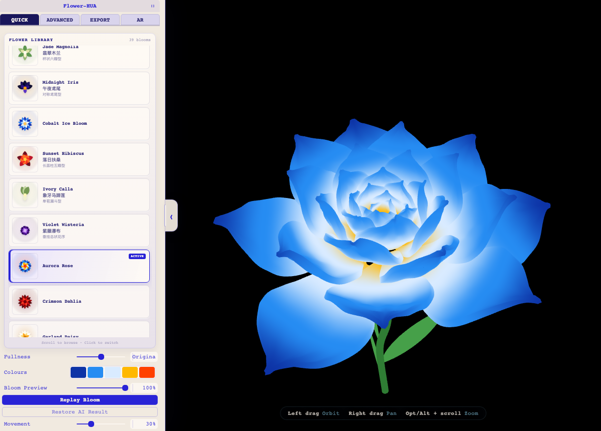

36 朵花的全貌：

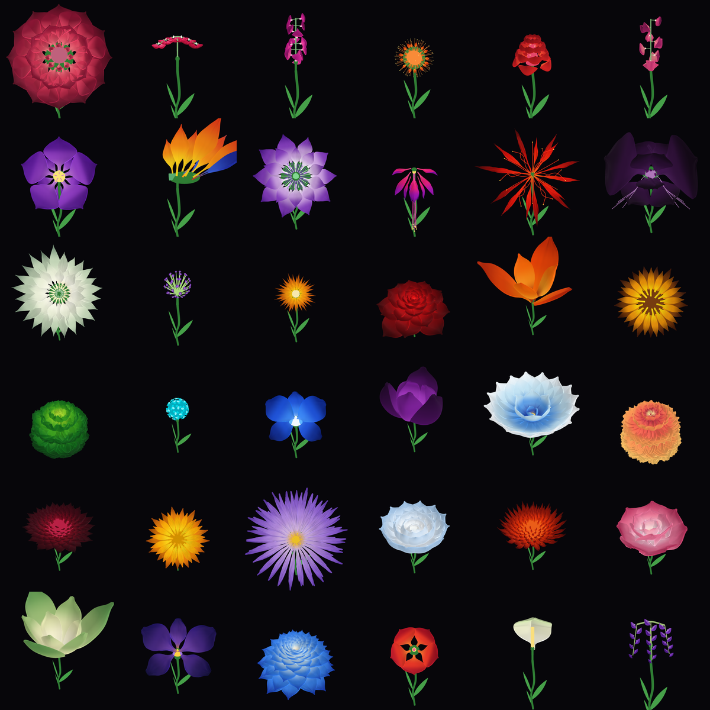

---

## 🌼 花朵图鉴

36 朵全部由引擎实时渲染，下图是无头浏览器实拍（620×620，软件 WebGL），不是美术贴图。

<table>
<tr>
<td align="center" width="25%">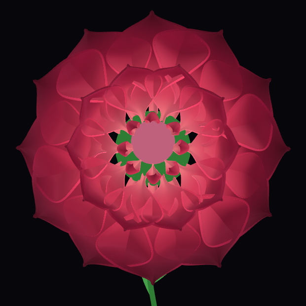</td>
<td align="center" width="25%">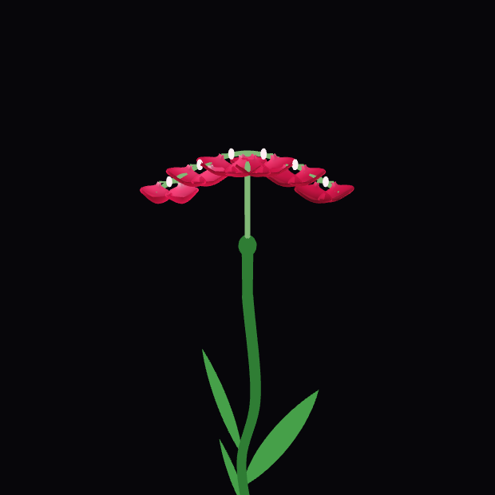</td>
<td align="center" width="25%">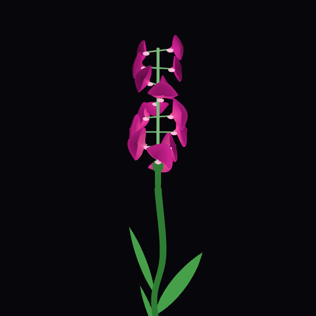</td>
<td align="center" width="25%">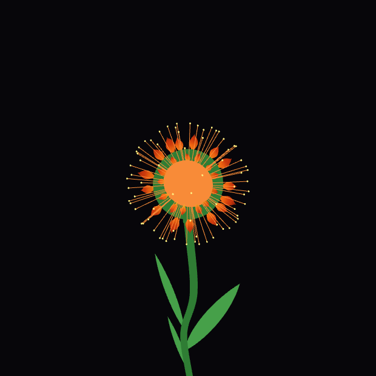</td>
</tr>
<tr>
<td align="center"><b>帝王花</b><br><sub>Royal Protea</sub><br><sub>盾冠苞片型</sub></td>
<td align="center"><b>红宝石荷包牡丹</b><br><sub>Ruby Bleeding Heart</sub><br><sub>心形垂序型</sub></td>
<td align="center"><b>玫红金鱼草</b><br><sub>Rose Snapdragon</sub><br><sub>双唇穗状型</sub></td>
<td align="center"><b>金针垫花</b><br><sub>Golden Pincushion</sub><br><sub>放射针冠型</sub></td>
</tr>
<tr>
<td align="center" width="25%">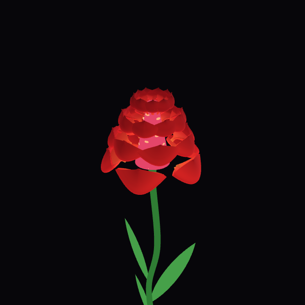</td>
<td align="center" width="25%">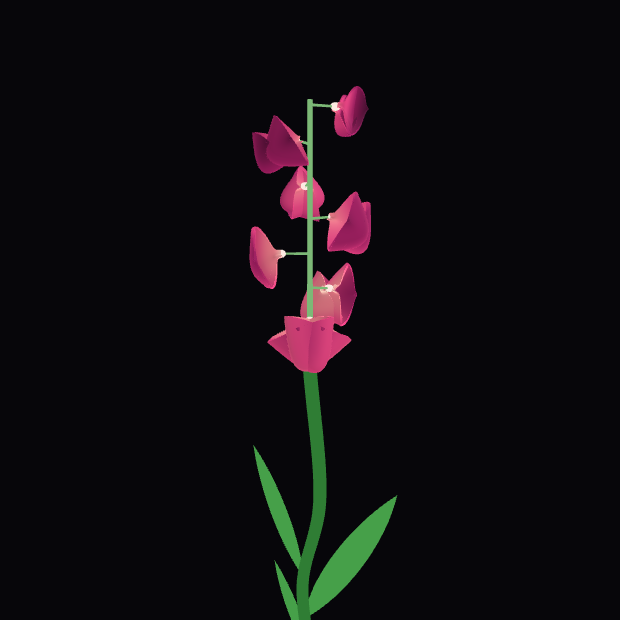</td>
<td align="center" width="25%"></td>
<td align="center" width="25%"></td>
</tr>
<tr>
<td align="center"><b>绯红火炬姜</b><br><sub>Crimson Torch Ginger</sub><br><sub>塔状蜡质苞片型</sub></td>
<td align="center"><b>珊瑚毛地黄</b><br><sub>Coral Foxglove</sub><br><sub>钟花穗状型</sub></td>
<td align="center"><b>紫晶耧斗菜</b><br><sub>Amethyst Columbine</sub><br><sub>五距星冠型</sub></td>
<td align="center"><b>鹤望兰</b><br><sub>Bird of Paradise</sub><br><sub>扇形异型花</sub></td>
</tr>
<tr>
<td align="center" width="25%"></td>
<td align="center" width="25%">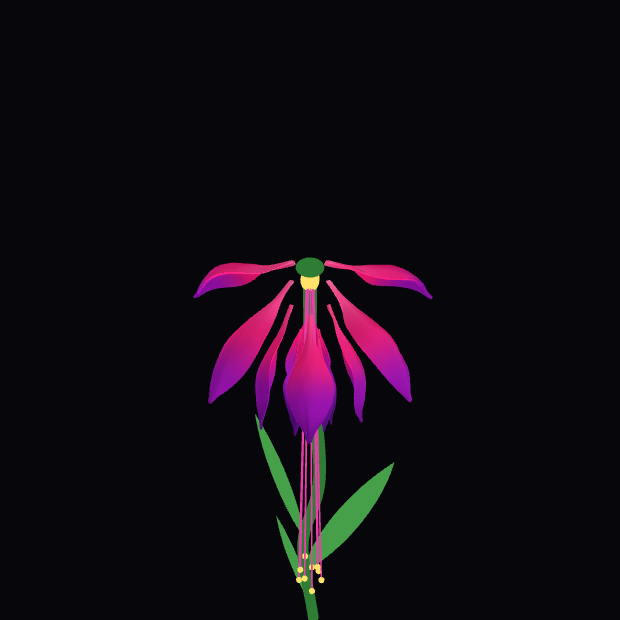</td>
<td align="center" width="25%">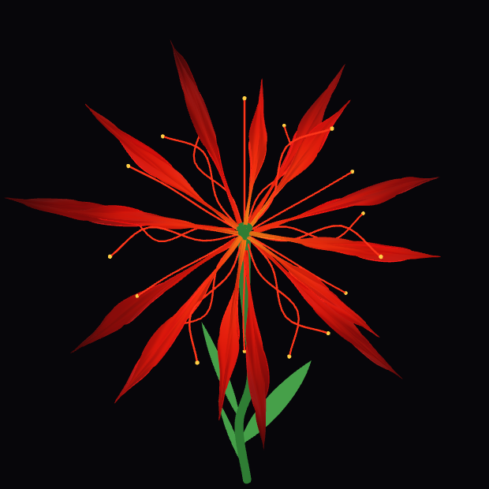</td>
<td align="center" width="25%">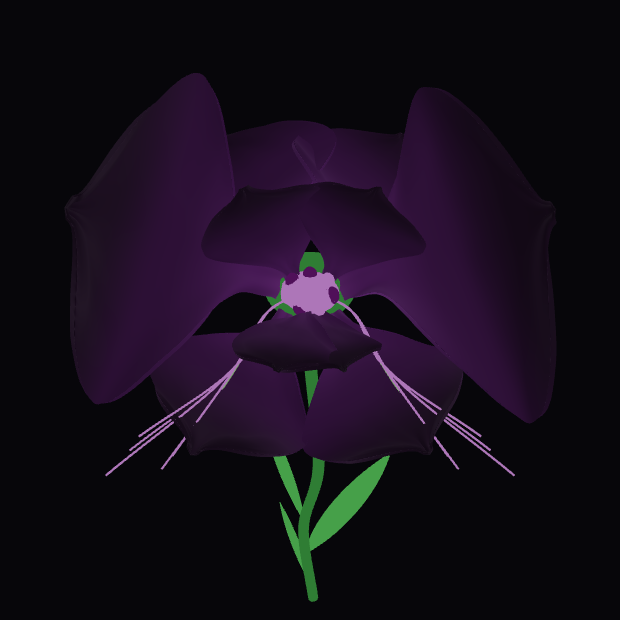</td>
</tr>
<tr>
<td align="center"><b>西番莲</b><br><sub>Passionflower Corona</sub><br><sub>放射冠状花</sub></td>
<td align="center"><b>倒挂金钟</b><br><sub>Fuchsia Lantern</sub><br><sub>垂吊灯笼型</sub></td>
<td align="center"><b>红花石蒜</b><br><sub>Scarlet Spider Lily</sub><br><sub>反卷蛛形花</sub></td>
<td align="center"><b>黑蝙蝠花</b><br><sub>Black Bat Flower</sub><br><sub>蝠翼异型花</sub></td>
</tr>
<tr>
<td align="center" width="25%">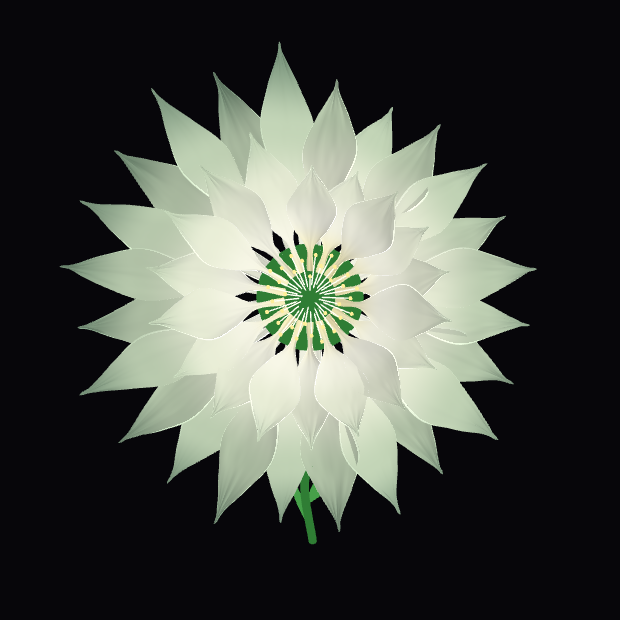</td>
<td align="center" width="25%">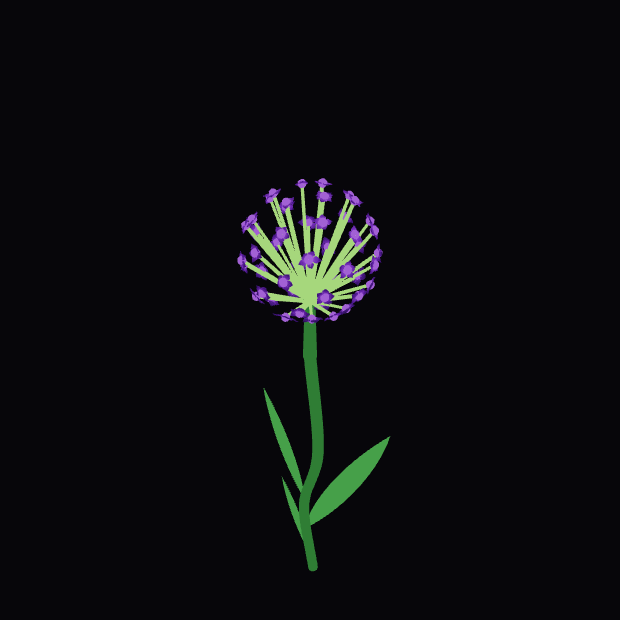</td>
<td align="center" width="25%"></td>
<td align="center" width="25%">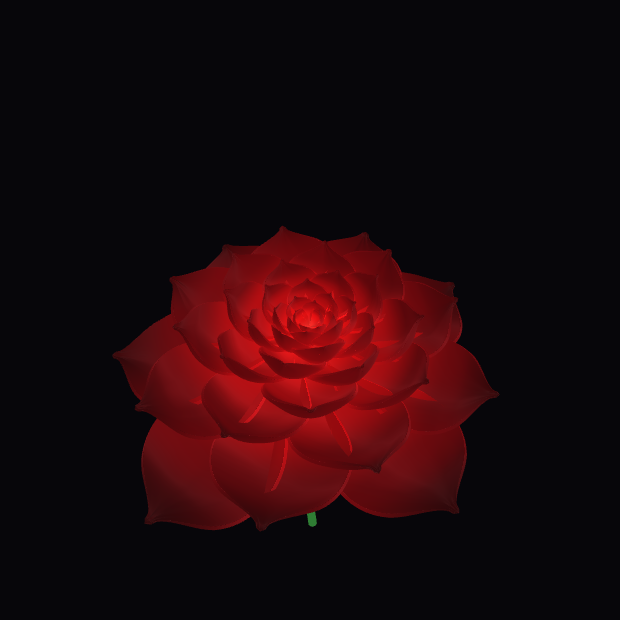</td>
</tr>
<tr>
<td align="center"><b>昙花</b><br><sub>Moonlit Cereus</sub><br><sub>夜开星形花</sub></td>
<td align="center"><b>大花葱</b><br><sub>Violet Allium</sub><br><sub>球状伞形花序</sub></td>
<td align="center"><b>蒲公英变形</b><br><sub>Dandelion Metamorphosis</sub><br><sub>蒲公英变形花</sub></td>
<td align="center"><b>绯红玫瑰</b><br><sub>Scarlet Rose</sub><br><sub>螺旋重瓣型</sub></td>
</tr>
<tr>
<td align="center" width="25%">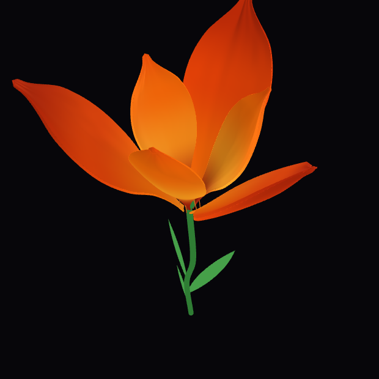</td>
<td align="center" width="25%"></td>
<td align="center" width="25%">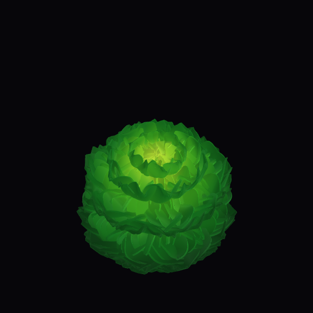</td>
<td align="center" width="25%"></td>
</tr>
<tr>
<td align="center"><b>橙焰百合</b><br><sub>Tangerine Lily</sub><br><sub>六瓣漏斗型</sub></td>
<td align="center"><b>金阳向日葵</b><br><sub>Sun Gold Sunflower</sub><br><sub>盘状放射型</sub></td>
<td align="center"><b>翡翠康乃馨</b><br><sub>Emerald Carnation</sub><br><sub>褶皱重瓣型</sub></td>
<td align="center"><b>青蓝绣球</b><br><sub>Cyan Hydrangea</sub><br><sub>球状聚伞花序</sub></td>
</tr>
<tr>
<td align="center" width="25%"></td>
<td align="center" width="25%">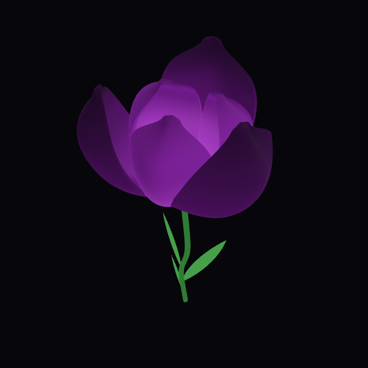</td>
<td align="center" width="25%"></td>
<td align="center" width="25%">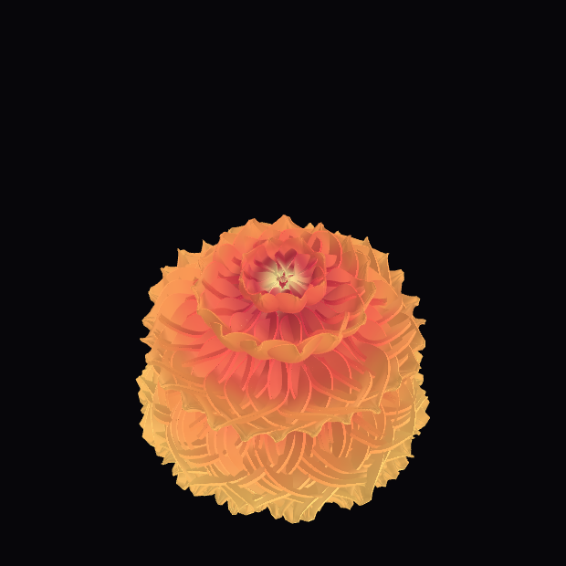</td>
</tr>
<tr>
<td align="center"><b>蓝宝石兰花</b><br><sub>Sapphire Orchid</sub><br><sub>对称兰花型</sub></td>
<td align="center"><b>紫罗兰郁金香</b><br><sub>Violet Tulip</sub><br><sub>杯状六瓣型</sub></td>
<td align="center"><b>月光莲</b><br><sub>Moonlit Lotus</sub><br><sub>碗状多轮花</sub></td>
<td align="center"><b>落日牡丹</b><br><sub>Sunset Peony</sub><br><sub>褶皱重瓣型</sub></td>
</tr>
<tr>
<td align="center" width="25%">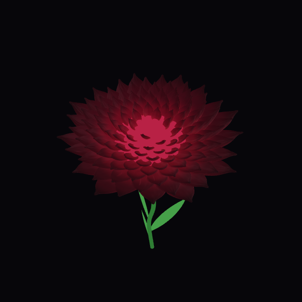</td>
<td align="center" width="25%">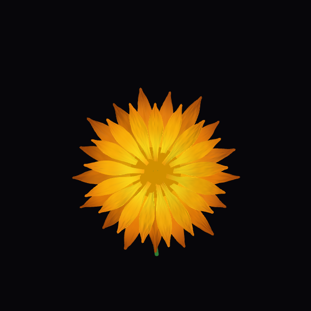</td>
<td align="center" width="25%">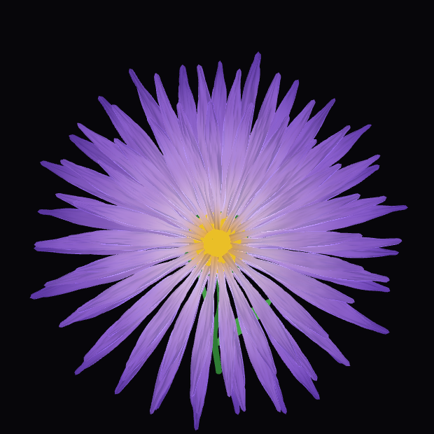</td>
<td align="center" width="25%">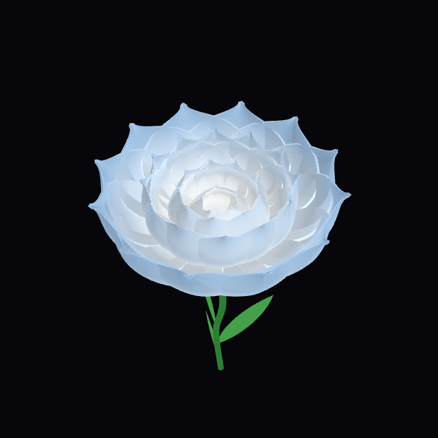</td>
</tr>
<tr>
<td align="center"><b>天鹅绒大丽花</b><br><sub>Velvet Dahlia</sub><br><sub>球状管瓣型</sub></td>
<td align="center"><b>金盏雏菊</b><br><sub>Golden Daisy</sub><br><sub>盘状舌状花</sub></td>
<td align="center"><b>薰衣草紫菀</b><br><sub>Lavender Aster</sub><br><sub>盘状舌状花</sub></td>
<td align="center"><b>极地山茶</b><br><sub>Arctic Camellia</sub><br><sub>碗状层叠花</sub></td>
</tr>
<tr>
<td align="center" width="25%">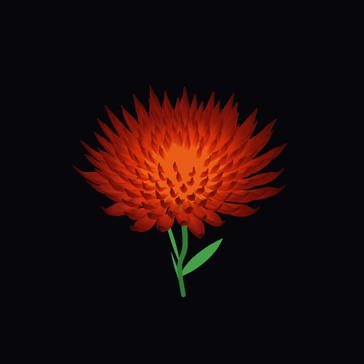</td>
<td align="center" width="25%"></td>
<td align="center" width="25%">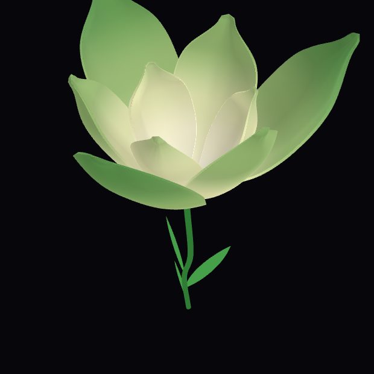</td>
<td align="center" width="25%"></td>
</tr>
<tr>
<td align="center"><b>余烬菊</b><br><sub>Ember Chrysanthemum</sub><br><sub>球状管瓣型</sub></td>
<td align="center"><b>樱云</b><br><sub>Sakura Cloud</sub><br><sub>碗状层叠花</sub></td>
<td align="center"><b>翡翠木兰</b><br><sub>Jade Magnolia</sub><br><sub>杯状六瓣型</sub></td>
<td align="center"><b>午夜鸢尾</b><br><sub>Midnight Iris</sub><br><sub>对称鸢尾型</sub></td>
</tr>
<tr>
<td align="center" width="25%">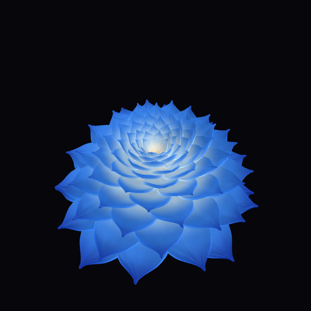</td>
<td align="center" width="25%"></td>
<td align="center" width="25%">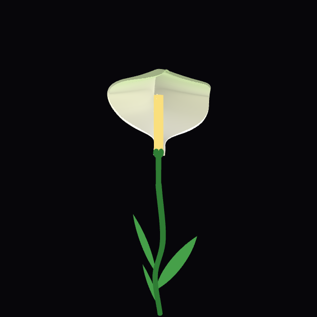</td>
<td align="center" width="25%">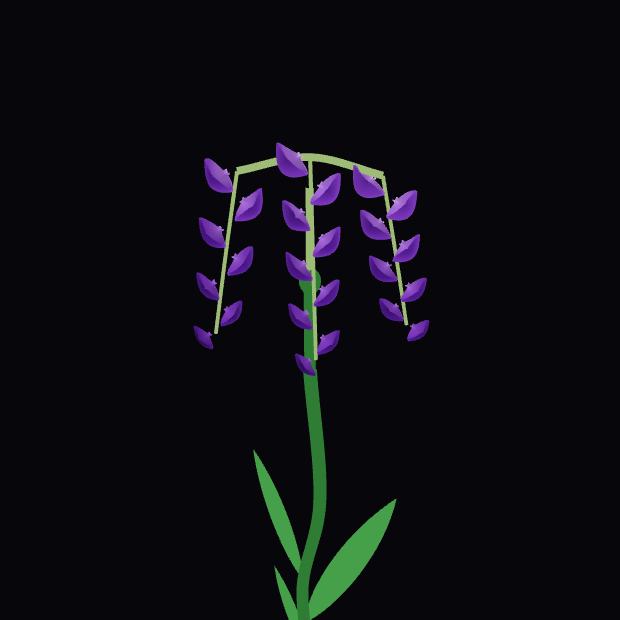</td>
</tr>
<tr>
<td align="center"><b>Cobalt Ice Bloom</b><br><sub>Cobalt Ice Bloom</sub><br><sub>—</sub></td>
<td align="center"><b>落日扶桑</b><br><sub>Sunset Hibiscus</sub><br><sub>长蕊柱五瓣型</sub></td>
<td align="center"><b>象牙马蹄莲</b><br><sub>Ivory Calla</sub><br><sub>单苞漏斗型</sub></td>
<td align="center"><b>紫藤瀑布</b><br><sub>Violet Wisteria</sub><br><sub>垂挂总状花序</sub></td>
</tr>
</table>
### 按结构分组

引擎不按植物学名字分类，而按**看得见的结构**。26 个结构科属被这 36 朵**全部覆盖**，一个不落。
花心（`core.kind`）是独立的一套几何体——花盘、雄蕊冠、唇瓣、肉穗、种球、须状体等 25 种，
不是用花瓣假装的。

| 结构科属 `family` | 花朵 | 瓣数 | 花心 `core.kind` |
|---|---|---|---|
| `broad-whorls` | 月光莲 | 24 | `seedpod` |
|  | 极地山茶 | 38 | `none` |
|  | 樱云 | 18 | `stamen-crown` |
| `radial-disc` | 金阳向日葵 | 34 | `disc` |
|  | 金盏雏菊 | 34 | `disc` |
|  | 薰衣草紫菀 | 78 | `disc` |
| `six-whorl` | 橙焰百合 | 6 | `stamen-crown` |
|  | 紫罗兰郁金香 | 6 | `none` |
|  | 翡翠木兰 | 9 | `seedpod` |
| `bilateral-orchid` | 蓝宝石兰花 | 5 | `lip` |
|  | 午夜鸢尾 | 6 | `lip` |
| `quilled-sphere` | 天鹅绒大丽花 | 128 | `petal-cushion` |
|  | 余烬菊 | 146 | `petal-cushion` |
| `ruffled-mass` | 翡翠康乃馨 | 110 | `none` |
|  | 落日牡丹 | 118 | `none` |
| `bat-wing` | 黑蝙蝠花 | 10 | `bat-whiskers` |
| `bird-fan` | 鹤望兰 | 9 | `bird-beak` |
| `bleeding-heart-raceme` | 红宝石荷包牡丹 | 12 | `heart-chain` |
| `calla-spathe` | 象牙马蹄莲 | 1 | `spadix` |
| `cluster-florets` | 青蓝绣球 | 120 | `floret-centers` |
| `columbine-spurs` | 紫晶耧斗菜 | 10 | `spur-crown` |
| `foxglove-spike` | 珊瑚毛地黄 | 14 | `bell-throats` |
| `hibiscus-column` | 落日扶桑 | 5 | `hibiscus-stamen` |
| `metamorphic-dandelion` | 蒲公英变形 | 84 | `seed-globe` |
| `nocturnal-star` | 昙花 | 42 | `star-stamens` |
| `passion-corona` | 西番莲 | 20 | `corona` |
| `pendant-fuchsia` | 倒挂金钟 | 12 | `pendant-stamens` |
| `pincushion-rays` | 金针垫花 | 28 | `pincushion-needles` |
| `protea-crown` | 帝王花 | 30 | `protea-cone` |
| `recurved-spider` | 红花石蒜 | 15 | `filament-crown` |
| `snapdragon-spike` | 玫红金鱼草 | 16 | `snapdragon-throats` |
| `spherical-umbel` | 大花葱 | 144 | `umbel-stalks` |
| `spiral-rosette` | 绯红玫瑰 | 48 | `none` |
| `torch-ginger` | 绯红火炬姜 | 32 | `torch-cone` |
| `wisteria-raceme` | 紫藤瀑布 | 24 | `wisteria-rachis` |
| `（legacy 无 anatomy）` | Cobalt Ice Bloom | 104 | `—` |
---

## 🧠 flower-engine Skill

这个仓库的主体是一个 **Agent Skill**——把引擎的知识从 4887 行 `flowerScene.ts`
加 761 行 `flowerAnatomy.ts` 里提出来，写成可查的表。

| 文件 | 内容 |
|---|---|
| [`SKILL.md`](SKILL.md) | 触发描述、代码地图、6 步创作循环、硬性上限 |
| [`references/params.md`](references/params.md) | **全部 43 个引擎参数**——默认值、区间、视觉效果，以及 rebuild / bake / uniform 三级**代价分类**（决定哪些能实时拖动，哪些会重建整个网格） |
| [`references/anatomy.md`](references/anatomy.md) | **26 个结构科属 × 25 种花心**——轮瓣数、variation 曲线、花心默认值、`core.count` 的双重钳位表 |
| [`references/translate.md`](references/translate.md) | 参考图 → `FlowerConfig` 的完整流程，含从 36 朵成品**实测**出的创作约定，以及一个逐项拆解的范例 |
| [`references/build.md`](references/build.md) | 三个数据存储、Studio 生命周期、导出管线、单文件打包器、三个 Playwright 验证器 |
| [`references/pitfalls.md`](references/pitfalls.md) | 约 20 个已经以约束形式写死在引擎源码里的失败模式 |

**每个数字都对着源码核验过，不是凭记忆写的**：43 个参数默认值、26 行科属表
（轮瓣数 / 花心种类 / 花心尺寸高度数量 / 每行 7 个 variation 值）、以及每一个
`count` 上限——全部由脚本逐项比对 `flowerScene.ts` 与 `flowerAnatomy.ts`。

### 安装

Claude Code：

```bash
git clone https://github.com/VR-Jobs/Flower-skill.git
ln -s "$(pwd)/Flower-skill" ~/.claude/skills/flower-engine
```

Codex 等其它 Agent Skills 宿主读的是 `~/.agents/skills`，链到那里即可。

### 它描述的代码不在这个仓库里

文档中的路径（`Studio/components/flower/flowerScene.ts`、`data/flowers.json`、
`scripts/upsert_flower.py`、`tools/single-html/`）相对的是 **Flower-HUA 项目根目录**，
不是本仓库。Skill 是那份代码库的阅读与创作指南；把项目 checkout 到旁边配合使用，
或者单独把这些文件当作引擎的设计记录来读。

---

## 🔧 引擎是怎么工作的

一句话：**一片花瓣，实例化很多次，在顶点着色器里被弯成不同的样子。**

- **叶序布局**（phyllotaxis）决定每片花瓣的位置、大小、倾角。默认发散角 137.5°，
  最多 150 片（`MAX_LAYOUT_PETALS`）。
- **单片花瓣的轮廓**由 5 个宽度控制点 `w0..w4` 经 Catmull-Rom 插值得到，
  烤进一张 **256×1 的 RGBA16F** 贴图：R 通道存宽度，G 通道存卷曲密度
  `curlBias·v^(curlBias−1)`。顶点着色器采样它来变形。
- **Anatomy V2** 在这之上选择结构渲染器与花心器官，让引擎不止能做玫瑰型的莲座。
- **绽放**是一道行进的波前（`bloom` / `transition` / `propagation`），固定 5 秒，
  导出时间线复用同一条曲线。

### 三个从数据里读出来的事实

这些在源码里看不出来，是把 36 朵成品统计出来的：

1. **36 朵全部设 `flat: false`。** 引擎默认的 `flat: true`（平面调子渲染）是那朵
   演示玫瑰的风格，不是照片复刻的基线。同理 `waveAmp`、`noiseAmp`、`jitter`、
   `wrapWidth` 的成品中位数都只有默认值的三分之一左右——**成品一律把风格化调低**。
2. **`goldenAngle` 不总是 137.5。** 小瓣数的对称花用 `360 / numPetals`：
   6 瓣百合/郁金香/鸢尾用 60°，5 瓣兰花用 72°，三出的木兰用 120°。
3. **参数有三条互不相通的更新路径**（`buildFlower()` 重建布局、`bakeRamps()` 重烤
   贴图、单个 uniform 写入）。走错一条，改了参数**什么都不会发生，而且不报错**。

---

## 🏗️ Demo 是怎么构建出来的

两个 demo 都是**单文件、零外部请求**，双击本地文件和在 Pages 上打开完全一样。

```bash
# 画廊：全部 36 朵，2.3 MB
node tools/single-html/build-flower-page.cjs all docs/index.html

# 单朵：任选一个 id
node tools/single-html/build-flower-page.cjs velvet-dahlia "双击打开 大丽花.html"

# 完整 Studio（含 MediaPipe 手势 AR，43 MB）
node tools/single-html/build-flower-hua-html.cjs
```

打包器借用 Next 自带的 webpack，把 TypeScript 源码、three.js、花朵数据全部内联进
一个 `<script>`。三个关键处理，少一个就坏：

- `LimitChunkCountPlugin({maxChunks: 1})`——`file://` 页面取不到同级 chunk；
- `</script` 转义并复查，否则 HTML 会被自己的 bundle 截断；
- 关闭压缩——Next 自带的压缩器指向一个私有构建期模块。

Studio 版还额外把 MediaPipe 的 wasm 与手势模型以 base64 内联，用到 AR 时才
materialize 成 Blob URL，所以双击启动不会卡。

### 验证

不是"应该能行"，是跑出来的。无头 Chrome + 软件 WebGL（`--enable-unsafe-swiftshader`）：

- 两个页面在 `file://` 与 `http://` 下都：**零页面错误、零外部请求**、canvas 正常出图；
- 36 张花朵图逐张检查非背景像素占比，**没有一张是空的或近空的**；
- 绽放周期用像素占比量化（向日葵暖色像素 7.9% → 14.2% → 重放回落 6.0%）。
  注：这个指标对阔瓣花（如莲花）无效——它的外瓣从头到尾占着轮廓，
  只能改用逐帧目视确认，本仓库对这类花就是这么验的。

---

## 📄 许可

[MIT](LICENSE) © VR-Jobs
